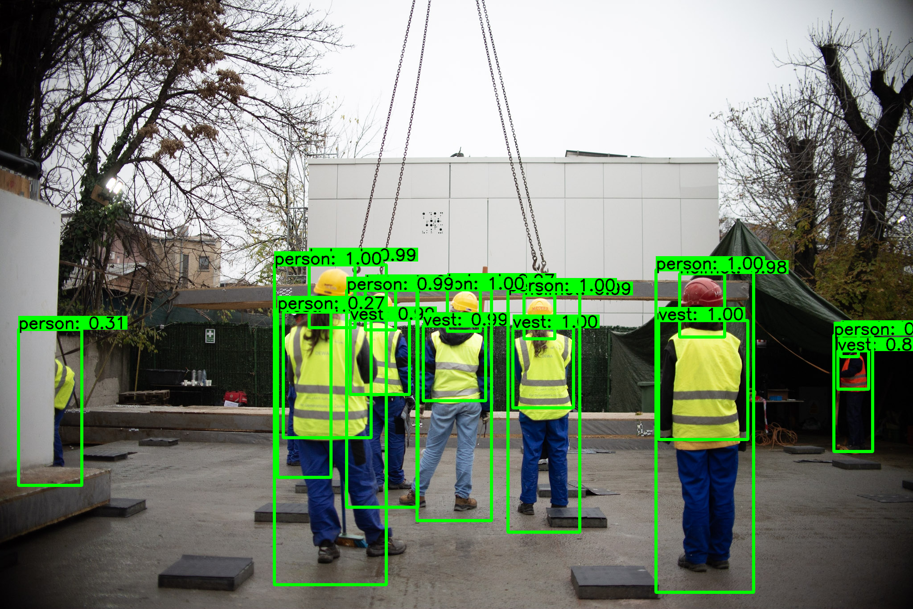
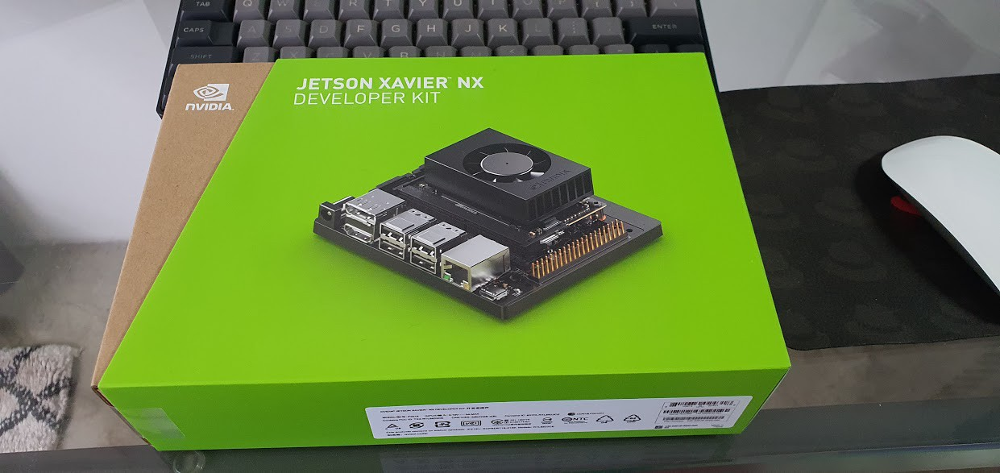
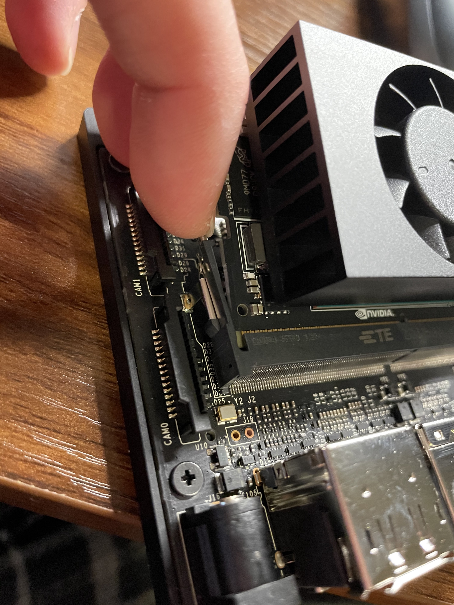

# Personal Protective Equipment (PPE) detection-Deepstream

The construction industry reports the highest number of fatal injury accidents every year. Even after thorough risk assessments and the implementation of adequate controls into a work environment, workers could still be subject to health and safety risks from hazards, which is why PPE is so important.



The main objective of the project is to identify in real-time some mandatory safety elements in workers' clothing, such as helmets,reflective vests,mask,headset.
## Citations

* [AlexeyAB/darknet](https://github.com/AlexeyAB/darknet)
* [aj-ames/Hermes-Deepstream](https://github.com/aj-ames/Hermes-Deepstream)
* [AdityaVarmaUddaraju/Helmet-Detection](https://github.com/AdityaVarmaUddaraju/Helmet-Detection)
* [marcoslucianops/DeepStream-Yolo](https://github.com/marcoslucianops/DeepStream-Yolo)

## Introduction

PPE detection Application consists of an Intelligent Video Analytics Pipeline powered by Deepstream and NVIDIA Jetson Xavier NX





This project is a proof-of-concept, trying to monitor the safety of workers on a construction site using Computer Vision and and is accelerated using NVIDIA Deepstream and can be done with a surveillance camera and an onboard Jetson platform.

This project detects objects of these 7 classes-head, helmet, mask, headset, chest, vest and person

## Deepstream Setup

This post assumes you have a fully functional Jetson device. If not, you can refer the documentation [here](https://docs.nvidia.com/jetson/jetpack/install-jetpack/index.html).

### 1. Install System Dependencies

```sh
sudo apt install \
libssl1.0.0 \
libgstreamer1.0-0 \
gstreamer1.0-tools \
gstreamer1.0-plugins-good \
gstreamer1.0-plugins-bad \
gstreamer1.0-plugins-ugly \
gstreamer1.0-libav \
libgstrtspserver-1.0-0 \
libjansson4=2.11-1
```
### 2. Install Deepstream

Download the DeepStream 5.0.1 Jetson Debian package `deepstream-5.1_5.1.0-1_arm64.deb`, to the Jetson device. Then enter the command:

```sh
sudo apt-get install ./deepstream-5.1_5.1.0-1_arm64.deb
```
## Running the Application

### 1. Clone the repository

This is a straightforward step, however, if you are new to git or git-lfs, I recommend glancing through the steps.

First, install git and git-lfs

```sh
sudo apt install git git-lfs
```

Next, clone the repository

```sh
# Using HTTPS
git clone https://github.com/FalconMadhab/PPE-Deepstream.git

#Using SSh
git@github.com:FalconMadhab/PPE-Deepstream.git
```

## 2. Weights: [here](https://drive.google.com/file/d/1y-XouaZKwFPY07-3plXhQ8WJUwg-_VZ2/view?usp=sharing)
Download the weights file from the above link and move to this folder

## 3. Compile

* x86 platform
```
CUDA_VER=11.1 make -C nvdsinfer_custom_impl_Yolo
```

* Jetson platform
```
CUDA_VER=10.2 make -C nvdsinfer_custom_impl_Yolo
```
This is a one-time step and you need to do this only when you make source-code changes.

### Understanding and editing deepstream_app_config
To understand and edit deepstream_app_config.txt file, read the [DeepStream SDK Development Guide - Configuration Groups](https://docs.nvidia.com/metropolis/deepstream/dev-guide/text/DS_ref_app_deepstream.html#configuration-groups)

##

* Edit source

Example for 1 source:
```
[source0]
enable=1
# 1=Camera (V4L2), 2=URI, 3=MultiURI, 4=RTSP, 5=Camera (CSI; Jetson only)
type=3
# Stream URL
uri=file:///home/user/Videos/input.mp4 or <rtsp url>
# Number of sources copy (if > 1, you need edit rows/columns in tiled-display section and batch-size in streammux section and config_infer_primary.txt; need type=3 for more than 1 source)
num-sources=1
gpu-id=0
cudadec-memtype=0
```

Example for 2 sources:
```
[source0]
enable=1
type=3
uri=file:///home/user/Videos/input.mp4 or <rtsp url>
num-sources=1
gpu-id=0
cudadec-memtype=0

[source1]
enable=1
type=3
uri=file:///home/user/Videos/input.mp4 or <rtsp url>
num-sources=1
gpu-id=0
cudadec-memtype=0
```
Now, run the application by running the following command:

```sh
deepstream-app -c deepstream_app_config.txt
```


## Video demonstration of the App

Link to video demonstartion [video_link](https://www.youtube.com/watch?v=p6SHAQUwRls)

## Referernces
- VW-PPE dataset + paper: http://aimir.isti.cnr.it/vw-ppe
- Colored helmets dataset: https://github.com/wujixiu/helmet-detection
- Darknet repository (training only): https://github.com/AlexeyAB/darknet
- YOLOv4 Tensorflow implementation (testing): https://github.com/hunglc007/tensorflow-yolov4-tflite
